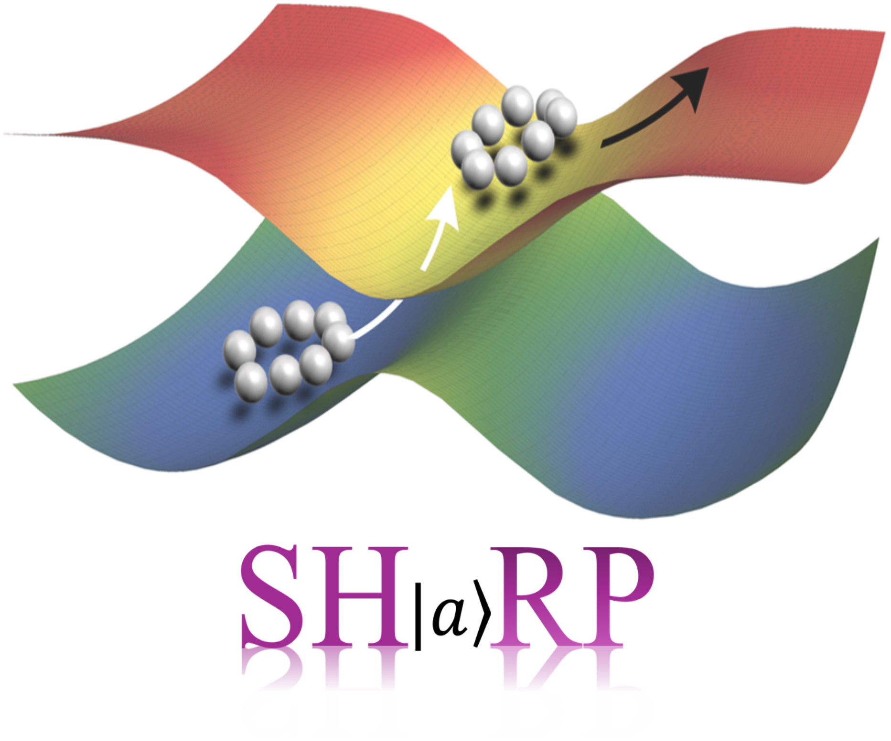

.. SHARPPack documentation master file, created by
   sphinx-quickstart on Mon Dec  2 08:02:34 2024.
   You can adapt this file completely to your liking, but it should at least
   contain the root `toctree` directive.

Welcome to SHARP Pack Documentation!
====================================

.. toctree::
   :maxdepth: 1
   :caption: Contents:

.. toctree::
   :maxdepth: 2
   :caption: Getting Started:

   intro
   install
   model
   simulation

.. toctree::
   :maxdepth: 1
   :caption: Theoretical Method:

   method-rpsh
   method-dboc
   method-decoh
   
.. toctree::
   :maxdepth: 1
   :caption: Tutorials:

   tutorials
   tutorial1_tully1s
   tutorial2_tully2p
   tutorial3_tully3b
   tutorial4_lchain
   tutorial5_spinboson

.. toctree::
   :maxdepth: 1
   :caption: Miscellaneous:

   changelog
   reference
