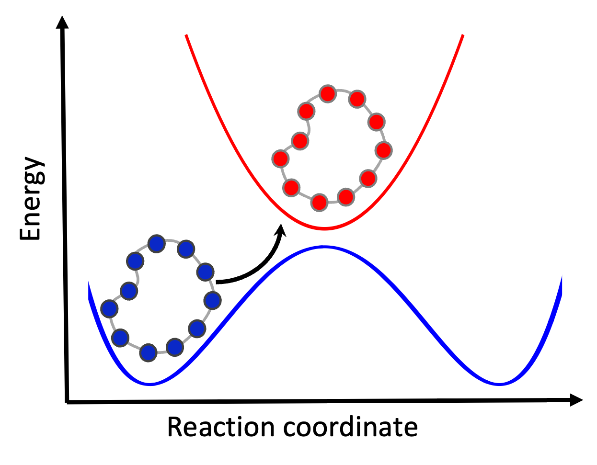

Ring Polymer Surface Hopping (RPSH) Algorithm
=============================================

The RPSH method combines the nuclear path-integral representation of nuclei :cite:`Craig:2004` with Tully's fewest-switches surface hopping :cite:`Tully:1990` scheme.

.. list-table::
   :widths: 50 50
   :align: center

   * - .. figure:: _static/figures/ringpolymer.png
          :width: 95%
          :align: center
          :alt: Path integral formalism

     - .. figure:: _static/figures/rpsh2.png
          :width: 95%
          :align: center
          :alt: Ring polymer surface hopping

For a system of :math:`N` particles in the electronic ground state, the general Hamiltonian is:

.. math::
   \hat{H} = \sum_{I=1}^{N} \frac{\hat{\mathbf{P}}_I^2}{2M_I} + \hat{V}(\mathbf{R}),
   :label: qHam

where

- :math:`\mathbf{R}`, :math:`\mathbf{P}` are nuclear position and momentum vectors,
- :math:`M_I` is the mass of the :math:`I`-th nuclear degree of freedom (DOF),
- :math:`\hat{V}(\mathbf{R})` is the potential energy surface.

The extended Hamiltonian :math:`H_n` for a ring polymer of **n** beads with positions :math:`\{\mathbf{R}_1, \dots, \mathbf{R}_n\}` and momenta :math:`\{\mathbf{P}_1, \dots, \mathbf{P}_n\}` is:

.. math::
   \begin{split}
   H_n(\mathbf{R},\mathbf{P}) = &\sum_{I=1}^N \sum_{k=1}^{n}
   \left[ \frac{P^2_{I,k}}{2M_{I,k}} +
   \frac{1}{2} M_{I,k} \omega_n^2 \left( R_{I,k} - R_{I,k-1} \right)^2 \right] \\
   &+ \sum_{k=1}^{n} V\left( R_{1,k}, \dots, R_{N,k} \right),
   \end{split}
   :label: piHam

The surface hopping approach can use the extended Hamiltonian (Eq. :eq:`piHam`) to propagate the entire ring polymer on a single adiabatic surface :math:`|\alpha; \mathbf{R} \rangle`, with non-adiabatic transitions between surfaces determined by the fewest-switches ansatz.  
The Hamiltonian is modified by introducing state-dependent potentials:

.. math::
   V_{\alpha}(\mathbf{R}) = \langle \alpha; \mathbf{R} | \hat{V} | \alpha; \mathbf{R} \rangle,

leading to the **Ring Polymer Surface Hopping (RPSH)** algorithm. This requires numerical integration of the time-dependent Schrödinger equation (TDSE) along classical trajectories.

Two approximations for TDSE propagation are used in RPSH :cite:`Shushkov:2012`:

1. **Bead Approximation (RPSH-BA)**  
   The TDSE is averaged over beads:

   .. math::
      i\hbar \dot{c}_{\alpha}(t) =
      \frac{1}{n}\sum_{k=1}^n V_{\alpha}(\mathbf{R}_k) c_{\alpha}(t)
      - i\hbar \sum_{\gamma} \frac{1}{n} \sum_{k=1}^n
      \dot{\mathbf{R}}_k \cdot \mathbf{d}_{\alpha\gamma}(\mathbf{R}_k) c_{\gamma}(t),

   where :math:`\mathbf{d}_{\alpha\gamma}(\mathbf{R}_k)` is the NACV for bead :math:`k`.

2. **Centroid Approximation (RPSH-CA)**  
   TDSE is evaluated at the ring-polymer centroid:

   .. math::
      \bar{\mathbf{R}} = \frac{1}{n} \sum_{k=1}^n \mathbf{R}_k, \quad
      \bar{\mathbf{P}} = \frac{1}{n} \sum_{k=1}^n \mathbf{P}_k,

   .. math::
      i\hbar \dot{c}_{\alpha}(t) =
      V_{\alpha}(\bar{\mathbf{R}}) c_{\alpha}(t)
      - i\hbar \sum_{\gamma}
      \dot{\bar{\mathbf{R}}} \cdot \mathbf{d}_{\alpha\gamma}(\bar{\mathbf{R}}) c_{\gamma}(t).

The probability of a non-adiabatic transition at each timestep :math:`\Delta t` is computed from the density matrix :math:`\rho_{\alpha\gamma} = c_{\alpha} c_{\gamma}^*` and NACVs within the framework of the FSSH algorithm,:cite:`Tully:1990` (needs to modify the corresponding relation appropriately for RPSH-BA or RPSH-CA).

   .. math::

        g_{\alpha\rightarrow\gamma} =
        \max\left(0, \frac{ -2\, 
        \mathrm{Re} \left[ \rho_{\gamma \alpha}^* \,
        \mathbf{\dot{R}}\cdot \mathbf{d}_{\gamma \alpha} \right]\,\delta t}
        {\rho_{\alpha\alpha}}\right).

Now attempt a hop between states. If a hop occurs, the ring polymer switches surfaces and nuclear velocities are rescaled to conserve total energy. If the hop is energetically forbidden, remain in the current state. 

Continue nuclear and electronic propagation until the end of the simulation time.
